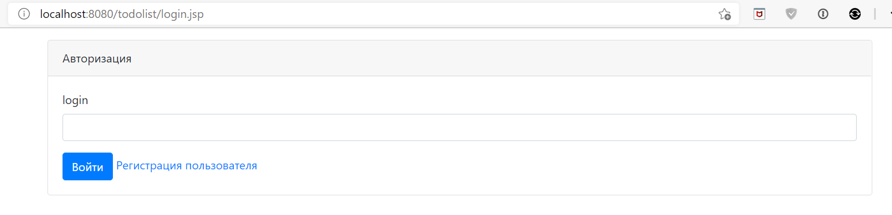
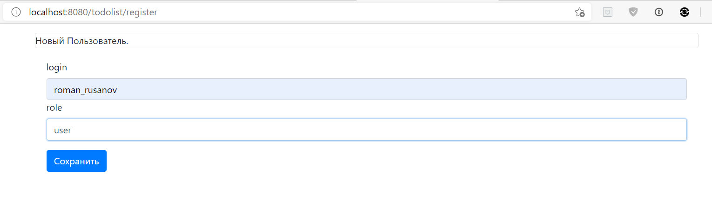
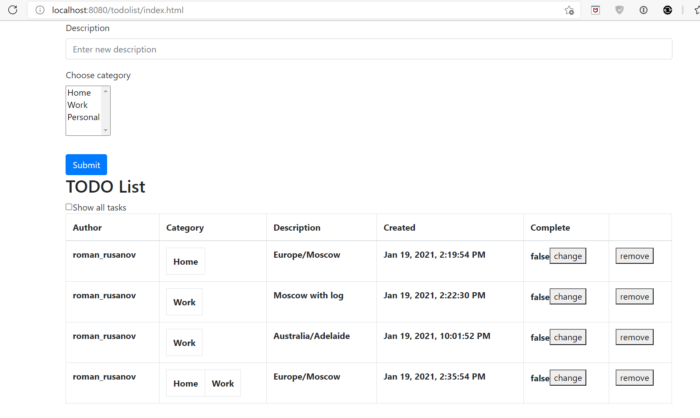

[](https://www.travis-ci.com/RomanRusanov/todolist)
[](https://www.codacy.com/gh/RomanRusanov/todolist/dashboard?utm_source=github.com&amp;utm_medium=referral&amp;utm_content=RomanRusanov/todolist&amp;utm_campaign=Badge_Grade)
#TODOList

Приложение позволяет вести список дел, регистрировать автора по имени пользователя, 
применять фильтр(отображать завершенные), выбирать несколько категорий для задачи. 
Все данные на форму загружаться через ajax.

### ScreenShot

1. Авторизация пользователя



2. Добавление пользователя


   
3. Список всех дел
   


# Конфигурирование:

*   Для использования необходима заполнить username, password и имя бд(url)```src/main/resources/hibernate.cfg.xml```
схема бд будет создана при помощи liquibase
*   Необходим webserver при разработке использовался Tomcat ver.9.0.39
    
    url - http://localhost:8080/todolist/
    
    application context - /todolist

##Контакты:
*   skype: rusanov_roman
*   telegram: @Roman_Rusanov